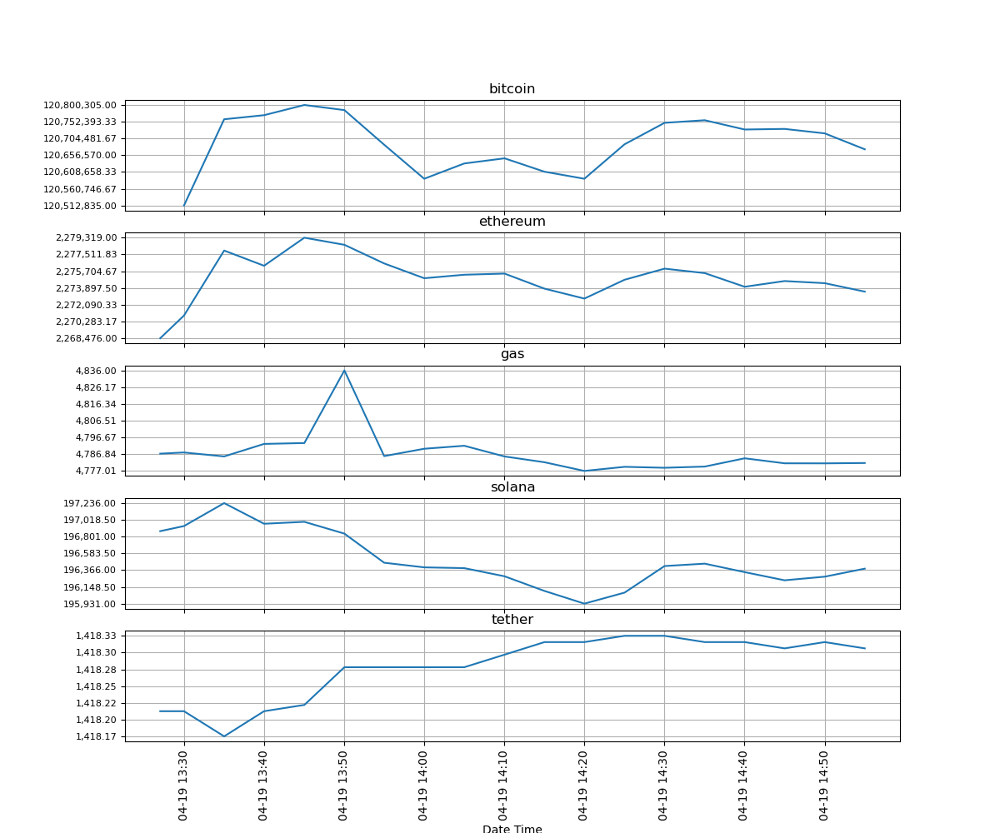

#   2주차 문제 
---
*   ####    문제1)
    ###### 코인주가 변동데이터 csv를 pandas를 사용하여 dataframe 형식으로 변환하기
    ######  인덱스 :["date_Time", "coin_Name", "usd", "krw", "usd_24h_change", "market_cap_usd"] 로 설정

    ###### 결과출력
    ```python
                 date_Time coin_Name        usd           krw  usd_24h_change  market_cap_usd
    0  2025-04-17 22:55:43   bitcoin    $84,551  119,773,236원            0.91   1678552258549
    1  2025-04-17 22:55:43  ethereum  $1,594.57    2,258,846원            1.32    192461868280
    2  2025-04-17 22:55:43       gas      $3.47      4,919.1원          -10.82       225582683
    3  2025-04-17 22:55:43    solana     $133.2      188,689원            6.44     68790138501
    4  2025-04-17 22:55:43    tether  $0.999826     1,416.34원           -0.01    144779930750
    ```

*   ####    문제2)
    ######  코인리스트 별로 선점도 그래프 그리기 
    ######  5행 1열로 그래프 그리기 (x축 시간 / y축은 금액 최대금액 최소금액 사이의 8개값으로 설정.)
    ```python
    import pandas as pd
    import matplotlib.pyplot as plt
    import matplotlib.ticker as ticker
    import matplotlib.dates as mlt_date
    import matplotlib.pyplot as plt
    import numpy as np

    #숫자형태로 변환
    file["krw"] = pd.to_numeric(file["krw"].str.replace(",","").str.replace("원","") ,errors="coerce")
    #날짜 타입으로 변환.
    file["date_Time"] = pd.to_datetime(file["date_Time"], format="%Y-%m-%d %H:%M:%S", errors="coerce")
    ```
    *   ###### 출력물
    