# 2장. 과학 계산, 데이터처리, 기초적인 그래프 제작 라이브러리 사용법.
<hr>

## 2.1 데이터 분석을 위한 라이브러리

### 핵심개념 
데이터 과학에서는 대량의 데이터를 전처리, 분석, 과학 연산 과정을 수행함.
이러한 과정이 필요할때 마다 처음부터 구현하는 것은 매우 비효율적임.

따라서, 이러한 과정을 수행하기 위한 라이브러리를 사용하여 효율적으로 작업을 수행함.
이러한 라이브러리들은 대량의 데이터를 처리하고 분석하는 데 필요한 다양한 기능을 제공함.

- NumPy : 기본적인 배열처리나, 행렬 연산을 위한 라이브러리. 수행속도가 빠르고, 데이터 분석에서 가장 기본이 되는 라이브러리.
- SciPy : Numpy의 기능을 더 강화한 라이브러리. 과학기술계산용 함수와 알고리즘을 제공함.
- Pandas : 데이터 분석을 위한 라이브러리. 데이터프레임을 사용하여 데이터를 쉽게 다룰 수 있도록 도와줌.
- Matplotlib : 데이터 시각화를 위한 라이브러리. 다양한 그래프를 그릴 수 있도록 도와줌.

### 2.1.1 라이브러리 Import

라이브러리를 이용하기 위해서는 우선 모듈(라이브러리)을 읽어 들여야함.<br>
다음 두가지 방법이 대표적인 모듈을 읽어들이는 방법임.
```python
import numpy as np #1
from numpy import * #2
``` 
모듈은 기능이 계층화되어 있어, 모듈명.기능명.기능명...과 같은 형식으로 표기하고 기능을 실행할 수 있음.

즉, 1번 구문에서는 numpy라는 모듈을 np라는 식별이름으로 읽어들인 것이고, 
이후 np.함수명()과 같은 형식으로 함수를 사용할 수 있음.

계층화된 라이브러리에서는 모듈명.기능명.기능명...과 같은 형식으로 정의되어있음
매번 import ... numpy as np와 같은 형식으로 사용하기에는 불편함.<br>

따라서, 2번과 같은 from 형식으로 import를 하게 되면, numpy라는 모듈의 모든 기능을 사용할 수 있음.<br>

2번 코드의 의미는 numpy라는 모듈의 모든 기능( * )을 읽어( from )들여서, 별도의 식별이름 없이 사용할 수 있도록 하는 것임.<br>

## 2.1.2 매직 명령어
Jupyter Notebook에서는 매직 명령어를 사용하여, 다양한 기능을 사용할 수 있음.<br>
매직 명령어는 %로 시작하는 명령어로, Jupyter Notebook에서만 사용 가능함.<br>
매직 명령어를 이용해, 일부 라이브러리의 동작 방식을 지정할 수 있음.
- %matplotlib inline : Jupyter Notebook에서 그래프를 그릴 때, 그래프를 노트북 안에 그리도록 설정함.
- %prescion : Jupyter Notebook에서 출력되는 결과의 형식을 지정함. 예를 들어, %precision 3은 소수점 3자리까지 출력하도록 설정함.


# 2.2 NumPy

Numpy에서 배열을 생성하는법은 일반 파이썬에서 List를 생성하는 것과 유사함.<br>
[1,3,2,5,6]처럼 리스트를 생성 후, numpy.array()함수를 이용하여 배열로 변환할 수 있음.<br>

```python
import numpy as np

data = np.array([1,5,2,6,4,8,9,7,3], dtype='int64')
print(data.dtype)
data = np.array([1,5,2,6,4,8,9,7,3], dtype='int32') # Change the data type
print(data.dtype)
print(data.ndim)
print(data.size)
data
```

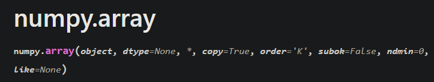

사진처럼, numpy.array() 함수에는 dtype이라는 인자가 존재함.<br>
dtype으로 array의 데이터 타입을 지정할 수 있음.<br>
dtype 미지정후 생성시, 기본적으로 int32로 생성됨.<br>
자료형을 변경할수도 있지만, 
```python
temp.dtype = 'int32'
```
와 같은 형식으로 변경할 수 없음.<br>
위 코드는 temp의 자료형 자체를 int32로 변경하는 것이 아니라, 메모리의 내용은 변경하지 않고, dtype의 reinterpret 방법만 강제로 int32로 변경한것이기 때문.<br>

따라서, temp의 자료형을 정확하게 변경하고 싶다면, astype()함수를 사용해야함.<br>
```python
temp1 = temp.astype('int32')
```
변경 후, temp1의 자료형을 확인하면, int32로 변경된 것을 확인할 수 있음. 자료형의 확인은 객체.dtype으로 확인할 수 있음.<br>

1장에서 살펴본 것 처럼, 파이썬에서 배열의 모든 원소에 특정한 수를 곱하기 위해서는 for loop를 사용해 반복작업을 해야함.
<br>
<hr>
넘파이의 array에도 sort method를 사용할 수 있음.

다만, sort() 메소드는 원본을 변경하는 메소드임. 그리고, sorted를 사용하면 dtype이 list로 변경이 되어버리니 주의해야함.

```python
data = np.array([1,5,2,6,4,8,9,7,3], dtype='int32')
print(f"Before sort : {data}")

data.sort()
print(f"After sort : {data}")
print(data)
print(data.dtype)

data[::-1].sort()
print(f"After sort #2 : {data}")
print(data)
print(data.dtype)

data = data[::-1]
data.sort()
print(f"After sort #3 : {data}")
print(data)
print(data.dtype)
```

```
sort : [1 5 2 6 4 8 9 7 3]
After sort : [1 2 3 4 5 6 7 8 9]
[1 2 3 4 5 6 7 8 9]
int32
After sort #2 : [9 8 7 6 5 4 3 2 1]
[9 8 7 6 5 4 3 2 1]
int32
After sort #3 : [1 2 3 4 5 6 7 8 9]
[1 2 3 4 5 6 7 8 9]
int32
```

파이썬에도 난수를 만드는 기능이 존재하지만, 데이터분석 분야에서는 numpy의 random 모듈을 사용하여 난수를 생성함.<br>

난수는 무작위로 생성하지않고, 수식에 의해 임의의 값을 만들어내며, 이를 의사 난수라고 부름.<br>
난수생성을 위한 초깃값을 seed라고 부르며, seed를 고정하면 항상 같은 난수를 생성함.<br>
```python
import numpy.random as random

random.seed(0)
random_data = random.randn(10)
print(random_data) # 책과 동일한 결과 return
```

```text
[ 1.76405235  0.40015721  0.97873798  2.2408932   1.86755799 -0.97727788
  0.95008842 -0.15135721 -0.10321885  0.4105985 ]
```
<hr>

ML에서 샘플 데이터를 추출할때, 임의로 추출하는 경우가 많음. <br>
이럴때에는 random.choice()함수를 사용하여, 임의로 샘플을 추출할 수 있음.<br>
```python
data = np.array([9,2,3,4,10,6,7,8,1,5])

print(random.choice(data,10)) # Replacement
print(random.choice(data,10,replace=False)) # Permutation
```
replace 옵션을 True로 설정하거나, 빈칸으로 두면, 중복 추출을 허용함.<br>
이런방식을 복원 추출이라고 부름<br>
중복조합과 비슷하지만, 중복조합에서는 순서를 고려하지않고 복원추출은 순서를 고려한다는 차이점이 있음.<br>
replace 옵션을 False로 설정하면, 중복 추출을 허용하지 않음.<br>
이런방식을 비복원 추출이라고 부름.<br>
수학에서의 Permutation과 유사하지만, Permutation은 모집단을 고정하고, 샘플을 뽑는 것이기 때문에, 모집단의 크기가 고정되어있음.<br>
반면에, 복원 추출은 모집단의 크기가 고정되어있지 않음.<br>
<hr>

넘파이를 이용하는 가장 큰 이유중 하나인 행렬계산.<br>
```python
array1 = np.arange(9,dtype='int64').reshape(3,3) # 1)
print(array1.dtype)

array1 = np.arange(9).reshape(3,3) 
compare_array1 = np.array([[0,1,2],[3,4,5],[6,7,8]]) # 2)

print(array1.dtype)
print(array1)
print(compare_array1)
array1 == compare_array1
```
```
int64
int32
[[0 1 2]
 [3 4 5]
 [6 7 8]]
[[0 1 2]
 [3 4 5]
 [6 7 8]]
True True True
True True True
True True True
```

1번 코드는 numpy의 arange()함수를 이용하여 0부터 8까지의 숫자를 생성한 후, reshape()함수를 이용하여 3x3 행렬로 변환한 것임. 또한, array처럼 dtype 인자 역시 존재해서, 자료형을 명시할 수 있음.<br>

arange는 for문에서 range()함수와 유사한 기능을 수행함.<br>

arange로 1차원 배열을 생성 후, 해당 객체를 reshape() 함수를 이용하여, (3,3) 형태로 변환함.<br>

2번 코드는 array로 일일히 입력하여, reshape로 3,3행렬을 생성한 것임.<br>
둘의 자료형, shape, 내용이 동일함을 확인할 수 있음.<br>

<hr>
행렬곱셈을 위해서는 @ 연산자를 사용하거나, numpy.dot() 함수를 사용함.<br>

```python
array2 = np.arange(9,18).reshape(3,3)
print(array2)
print(np.dot(array1, array2)) # Marix Multiplication
print(array1 * array2) # Element-wise Multiplication
print(array1 @ array2) # Marix Multiplication
```
```
[[ 9 10 11]
 [12 13 14]
 [15 16 17]]
[[ 42  45  48]
 [150 162 174]
 [258 279 300]]
[[  0  10  22]
 [ 36  52  70]
 [ 90 112 136]]
[[ 42  45  48]
 [150 162 174]
 [258 279 300]]
```

원소가 0으로 채워진 영행렬이나 원소가 1로 채워진 행렬을 생성하기 위해서는 numpy.zeros(), numpy.ones()함수를 사용함.<br>
```python
print(np.zeros((2,3), dtype='int64'))
print(np.ones((2,3), dtype=np.float64))
```
```
[[0 0 0]
 [0 0 0]]
[[1. 1. 1.]
 [1. 1. 1.]]
```

## 연습문제

```python
# Practice 2-1
numarr = np.arange(1,51)
answer1 = np.sum(numarr)
print(f"Practice 2-1 Answer : {answer1}\n")
# Practice 2-2
print(f"Practice 2-2 Answer Down below\n")
numarr = random.randn(10)
print(f"Generated Random Number : {numarr}")
min_v = np.min(numarr)
max_v = np.max(numarr)
print(f"Minimum Value : {min_v}")
print(f"Maximum Value : {max_v}")
summation_min_max = np.sum(numarr)
print(f"Summation of Array : {summation_min_max}\n")
P2_3_A = np.full((5, 5),3)
print(f"Practice 2-3 Answer : \n{P2_3_A@P2_3_A}")
```

```text
Practice 2-1 Answer : 1275

Practice 2-2 Answer Down below

Generated Random Number : [ 1.49407907 -0.20515826  0.3130677  -0.85409574 -2.55298982  0.6536186
  0.8644362  -0.74216502  2.26975462 -1.45436567]
Minimum Value : -2.5529898158340787
Maximum Value : 2.2697546239876076
Summation of Array : -0.21381832081082974

Practice 2-3 Answer : 
[[45 45 45 45 45]
 [45 45 45 45 45]
 [45 45 45 45 45]
 [45 45 45 45 45]
 [45 45 45 45 45]]
```


# 2.3 SciPy
SciPy는 Numpy의 기능을 확장한 라이브러리로, 과학기술계산용 함수와 알고리즘을 제공함.<br>

여기서는 선형대수의 역행렬, 고유값, 고유벡터 그리고 방정식의 해를 구하는 방법을 살펴봄.<br>

- 행렬식 : det() 정사각행렬에 대하여 정의된 스칼라 값으로, 행렬의 성질을 나타내는 값임.<br> 역행렬이 존재하는지, 선형 독립성 판단 등의 근거로 사용.
만약, det(A) = 0 이면, 역행렬이 존재하지 않음.<br>
그런 경우는 벡터들이 선형 종속상태에 있다는 것을 의미함.

```text
A = np.array([[a,b,c],[d,e,f],[g,h,i]])
det(A) = a(ei-fh) - b(di-fg) + c(dh-eg)
```

- 고유벡터와 고윳값 : 행렬A가 있고, 0이 아닌벡터 v, 상수Y가 존재할때, Av = Yv를 만족하는 경우, v를 A의 고유벡터, Y를 A의 고윳값이라고 부름.<br>
즉, 고유벡터는 행렬 A(변환) 에 의해 자신의 방향은 변하지않고, 크기 및 부호만 Y배로 변하는 벡터를 의미함.<br>
고윳값은 그 고유벡터가 상수 Y에 의해 변화하는 정도를 나타내는 값임.<br>(실수배)

Example
```python
array = np.array([[1,-1,-1],[-1,1,-1],[-1,-1,1]])
print(f"{linag.det(array)}\n") # Determinant
print(f"{linag.inv(array)}\n") # Inverse
print(f"{array.dot(linag.inv(array))}\n") # Identity Matrix

```
```
-4.0

[[ 0.  -0.5 -0.5]
 [-0.5 -0.  -0.5]
 [-0.5 -0.5  0. ]]
-4.0

[[ 0.  -0.5 -0.5]
 [-0.5 -0.  -0.5]
 [-0.5 -0.5  0. ]]

[[1. 0. 0.]
 [0. 1. 0.]
 [0. 0. 1.]]

```

<hr>

뉴턴법. scipy.optimize.newton

방정식의 해의 근삿값을 구할때 쓰는 함수.<br>
왜 근삿값인가? 
floating point의 한계로 인해, 정확한 값을 구할 수 없기 때문.<br>

```python
from scipy.optimize import minimize_scalar
from scipy.optimize import newton
import math

def func1(x):
    return x**2 + 2*x + 1
print(f"Newton Method : {newton(func1, 0)}\n") # Approximately -1
print(f"Minimize Scalar : \n{minimize_scalar(func1,method='Brent')}")
```

```
Newton Method : -0.9999999852953906

Minimize Scalar : 
 message: 
          Optimization terminated successfully;
          The returned value satisfies the termination criteria
          (using xtol = 1.48e-08 )
 success: True
     fun: 0.0
       x: -1.0000000000000002
     nit: 4
    nfev: 8
```

<hr>

### 응용 및 연습문제

```python
# Try Problem
def temp2(x):
    return np.exp(-x) * np.sin(2*x) + 0.1*x

root = newton(temp2, x0=0.5)
print(f"X Value : {root}")
print(f"Asymptotic Value : {temp2(root)}")

print(f"Total output : \n{minimize_scalar(temp2, method='bounded', bounds=(0, 10))}")
print(f"Location of minimum X Value: {minimize_scalar(temp2, method='bounded', bounds=(0, 10)).x}")
print(f"Minimum value of function : {minimize_scalar(temp2, method='bounded', bounds=(0, 10)).fun}")

import numpy as np
import matplotlib.pyplot as plt

xs = np.linspace(0, 10, 400)
ys = temp2(xs)
plt.plot(xs, ys, label='temp2(x)')
plt.axhline(0, color='gray', linestyle='--')
plt.xlabel("x")
plt.ylabel("f(x)")
plt.title("Plot of temp2 function")
plt.legend()
plt.show()

```
```
X Value : 7.403986005115649e-21
Asymptotic Value : 1.5548370610742863e-20
Total output : 
 message: Solution found.
 success: True
  status: 0
     fun: 0.09709473807682402
       x: 1.9624235423071699
     nit: 13
    nfev: 13
Location of minimum X Value: 1.9624235423071699
Minimum value of function : 0.09709473807682402
```
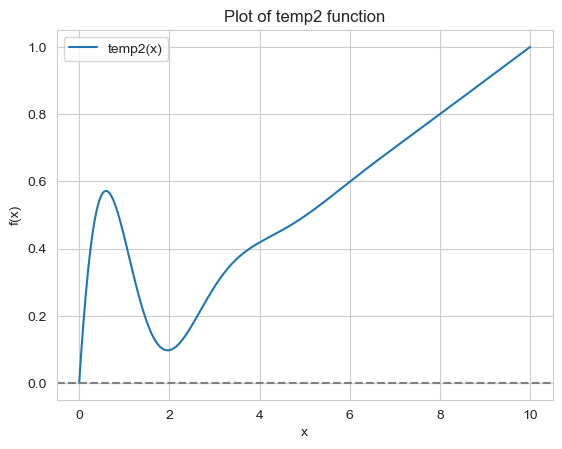

```python
# Practice 2-4
prac2_4_array = np.array([[1,2,3],[1,3,2],[3,1,2]])
print(f"Practice 2-4 Answer : \n{linag.det(prac2_4_array)}")

print(f"Practice 2-5 Answer : Inverse Matrix : \n{linag.inv(prac2_4_array)}")
print(f"Eigen Value : \n{linag.eig(prac2_4_array)[0]}")
print(f"Eigen Vector : \n{linag.eig(prac2_4_array)[1]}")

# Practice 2-6
def func3(x):
    return x**3 + 2*x + 1
print(f"Practice 2-6 Answer : \n{newton(func3, x0=0)}")
```
```
Practice 2-4 Answer : 
-12.000000000000002

Practice 2-5 Answer : Inverse Matrix : 
[[-0.33333333  0.08333333  0.41666667]
 [-0.33333333  0.58333333 -0.08333333]
 [ 0.66666667 -0.41666667 -0.08333333]]
Eigen Value : 
[ 6.        +0.j -1.41421356+0.j  1.41421356+0.j]
Eigen Vector : 
[[-0.57735027 -0.72236645  0.16041816]
 [-0.57735027 -0.14290228 -0.81090869]
 [-0.57735027  0.67658381  0.56275492]]
 
Practice 2-6 Answer : 
-0.45339765151640365
```

# 2.4 Pandas
판다스는 파이썬에서 ML Model을 만들시전, 데이터를 Preprocessing하는데 사용되는 라이브러리임.<br>
작동방식이 SQL과 유사하여, SQL을 사용해본 사람이라면 쉽게 사용할 수 있음.<br>

Series는 List와 유사한 형태로, 1차원 배열을 의미함.<br>

넘파이의 1차원 array를 기반으로 구성되어있음.<br>

또한, Index Parameter가 존재하여, 각 원소에 이름을 붙일 수 있음.<br>

```python
sample_pandas_data = pd.Series([0,10,20,30,40,50,60,70,80,90])
print(sample_pandas_data)
sample_pandas_index_data = pd.Series([0,10,20,30,40,50,60,70,80,90], index=['a','b','c','d','e','f','g','h','i','j'])
print(sample_pandas_index_data)
print(sample_pandas_index_data.values)
print(sample_pandas_index_data.index)
```

```text
a     0
b    10
c    20
d    30
e    40
f    50
g    60
h    70
i    80
j    90
dtype: int64
[ 0 10 20 30 40 50 60 70 80 90]
Index(['a', 'b', 'c', 'd', 'e', 'f', 'g', 'h', 'i', 'j'], dtype='object')
```

DataFrame은 2차원 배열을 의미함.<br>
Dictionary와 유사한 형태로, Key와 Value로 구성되어있지만, Value에 List 형태의 데이터가 들어가서 2차원 배열을 형성함.<br>
```python
data1 = {
    'ID' : ['100','101','102','103','104'],
    'City' : ['Seoul','Pusan','Daegu','Gangneung','Seoul'],
    'Birth_year' : [1990,1989,1992,1997,1982],
    'Name' : ['Junho','Heejin','Mijung','Minho','Steve']
}

data_frame1 = pd.DataFrame(data1)
print(data_frame1)
data_frame1_index = pd.DataFrame(data1, index=['0','1','2','3','4'])
data_frame1_index.T # Transpose
```

```
    ID       City  Birth_year    Name
0  100      Seoul        1990   Junho
1  101      Pusan        1989  Heejin
2  102      Daegu        1992  Mijung
3  103  Gangneung        1997   Minho
4  104      Seoul        1982   Steve
```
특정한 열만 추출하고싶으면 데이터 다음에 열을 지정하면됨.<br>
복수의 열은 객체.[['열1','열2']]와 같은 형식으로 지정하면됨.<br>
```python
print(data_frame1_index.Birth_year)
print(data_frame1_index[['ID','Birth_year']])
```
```
0    1990
1    1989
2    1992
3    1997
4    1982
Name: Birth_year, dtype: int64

    ID  Birth_year
0  100        1990
1  101        1989
2  102        1992
3  103        1997
4  104        1982
```
<hr>
DataFrame에서 특정한 조건을 만족하는 데이터만을 추출하거나, 복수의 데이터를 결합하는 작업이 가능.

```python
DataFrame[Condition[Column] == 'Value']
```
형식으로 조건을 지정할 수 있음.<br>
Example
```python
print(data_frame1_index[data_frame1_index['City'] == 'Seoul']) # DataFrame[Condition[Column] == 'Value']]
print(data_frame1_index[data_frame1_index['Birth_year'] < 1990])
```
```
    ID   City  Birth_year   Name
0  100  Seoul        1990  Junho
4  104  Seoul        1982  Steve
    ID   City  Birth_year    Name
1  101  Pusan        1989  Heejin
4  104  Seoul        1982   Steve
```

데이터 결합은 merge 함수를 사용한다. 이때, parameter로 on을 사용하여, 결합할 열을 지정하거나, inner, outer, left, right를 사용하여 결합방식을 지정할 수 있음.<br>
```python
dfi1 = pd.DataFrame({
    'ID' : ['1','2','3','4','5'],
    'Sex' : ['F','F','M','M','F'],
    'Money' : [1000,2000,500,300,700],
    'Name' : ['Suji','Minji','Taeho','Jinsung','Suyoung']
})
dfi2 = pd.DataFrame({
    'ID' : ['3','4','7'],
    'Math' : [60,30,40],
    'English' : [80,20,30]
})
dfi3 = pd.merge(dfi1, dfi2, on='ID', how='inner')
print(dfi3)
```

```
  ID Sex  Money     Name  Math  English
0  3   M    500    Taeho    60       80
1  4   M    300  Jinsung    30       20
```

데이터 집계 또한 sql과 유사하게 groupby() 함수를 사용하여 수행할 수 있음.<br>
```python
print(dfi1.groupby('Sex')['Money'].mean())
```

```
Sex
F    1233.333333
M     400.000000
```

데이터 전처리에는 결측값 처리가 중요하다. <br>
결측값 같은 데이터는 nan으로 저장되는데 이를 다루는 방법을 알아보자.<br>
nan인지 아닌지 판별하려면 isnull() 함수를 사용하면됨.<br>
```python
data_frame1_index3['Name'] = np.nan
print(data_frame1_index3.isnull())
```

```
      ID   City  Birth_year  Name
e  False  False       False  True
a  False  False       False  True
c  False  False       False  True
d  False  False       False  True
b  False  False       False  True
```
<hr>

## 종합문제 및 연습문제
```python
# Practice 2-7
dfi1 = pd.DataFrame({
    'ID' : ['1','2','3','4','5'],
    'Sex' : ['F','F','M','M','F'],
    'Money' : [1000,2000,500,300,700],
    'Name' : ['Suji','Minji','Taeho','Jinsung','Suyoung']
})
print(dfi1[dfi1['Money']>=500]) # DataFrame[Condition[Column] >= Value]

# Practice 2-8
print(dfi1.groupby('Sex')['Money'].mean())

# Practice 2-9
dfi2 = pd.DataFrame({
    'ID' : ['3','4','7'],
    'Math' : [60,30,40],
    'English' : [80,20,30]
})
dfi3 = pd.merge(dfi1, dfi2, on='ID', how='inner')
print(dfi3)
print(dfi3[['Money','Math','English']].mean())
```
```
  ID Sex  Money     Name
0  1   F   1000     Suji
1  2   F   2000    Minji
2  3   M    500    Taeho
4  5   F    700  Suyoung
Sex
F    1233.333333
M     400.000000
Name: Money, dtype: float64
  ID Sex  Money     Name  Math  English
0  3   M    500    Taeho    60       80
1  4   M    300  Jinsung    30       20
Money      400.0
Math        45.0
English     50.0
dtype: float64
```
<hr>

# 2.5 Matplotlib

데이터 분석 과정에서 데이터 시각화는 매우 중요한 과정임.<br>
데이터를 시각화함으로써, 데이터의 분포나 경향성을 쉽게 파악할 수 있음.<br>
데이터 시각화를 위해서는 matplotlib이라는 라이브러리를 사용함.<br>

산점도는 2개의 데이터값을 x축과 y축에 각각 대응시켜서 점으로 표현한 그래프임.<br> plot(x,y,'o')과 같은 형식으로 사용.
```python
random.seed(0)
x = np.random.randn(30)
y = np.sin(x) + np.random.randn(30)
plt.figure(figsize=(20,6))
# plt.plot(x, y, 'o')
plt.scatter(x,y)
plt.title('Scatter plot')
plt.xlabel('X-axis')
plt.ylabel('Y-axis')
plt.grid(True)
```
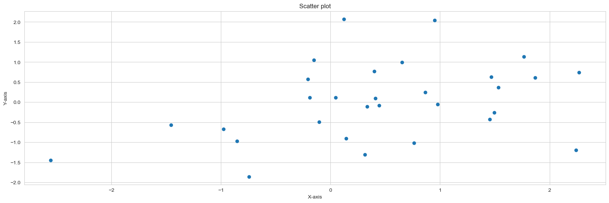

만약 데이터가 연속된 값이면, plot으로 그려지는 그래프는 점이 아니라 선으로 연결된 것 처럼 보여짐.<br>
```python
random.seed(0)
x1 = np.arange(1000)
y1 = np.random.randn(1000).cumsum()
plt.figure(figsize=(20,6))
plt.plot(x1, y1,label = 'Label')
plt.legend()
plt.xlabel('X-axis')
plt.ylabel('Y-axis')
plt.grid(True)
```
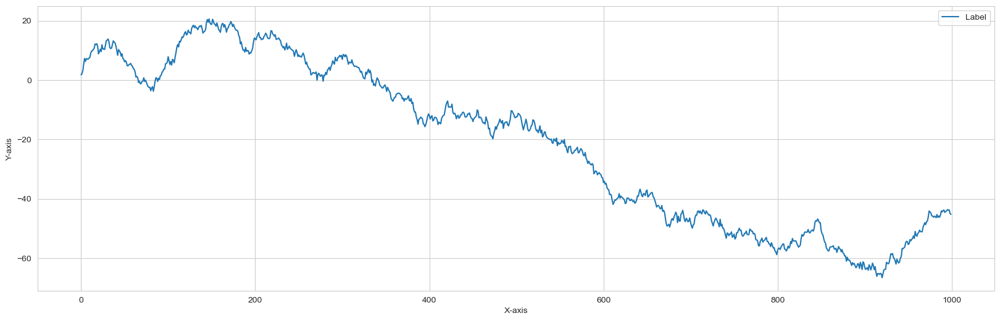


또한, subplot을 사용하여, 여러개의 그래프를 한 화면에 그릴 수 있음.<br>
subplot(2,1,1)은 2행 1열의 그래프에서 1번째 그래프를 의미함.<br>
```python
plt.figure(figsize=(20,6))
plt.subplot(2,1,1)
x2 = np.linspace(-10,10,100)
plt.plot(x2, np.sin(x2))

plt.subplot(2,1,2)
y2 = np.linspace(-10,10,100)
plt.plot(y2, np.cos(2*y2))
plt.grid(True)
```
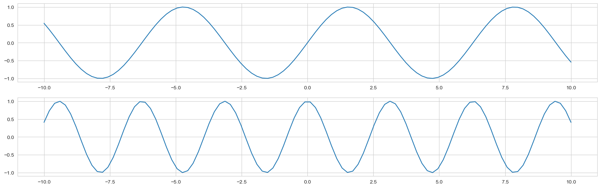

함수그래프도 그릴 수 있다. <br>
```python
def func3(x):
    return x**2 + 2*x + 1
x = np.arange(-10,10) # X 범위 정의
plt.figure(figsize=(20,6))
plt.plot(x, func3(x))
plt.grid(True)
```
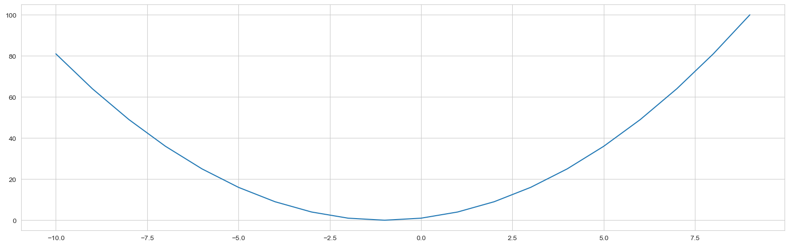

히스토그램은 각 데이터의 빈도를 나타내는 그래프임. 데이터 분석과정에서 데이터의 분포를 파악하는데 유용함.<br>
```python
random.seed(0)
plt.figure(figsize=(20,6))
plt.hist(random.randn(10**5) * 10 + 50, bins=60, range=(20,80))
plt.grid(True)
?plt.hist
```
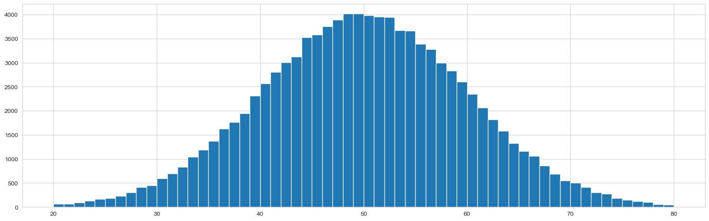

## 종합문제 및 연습문제
```python
# Practice 2-10
def func4(x):
    return 5*x + 3
x = np.arange(-10,10)
plt.figure(figsize=(20,6))
plt.plot(x, func4(x))
plt.grid(True)
```
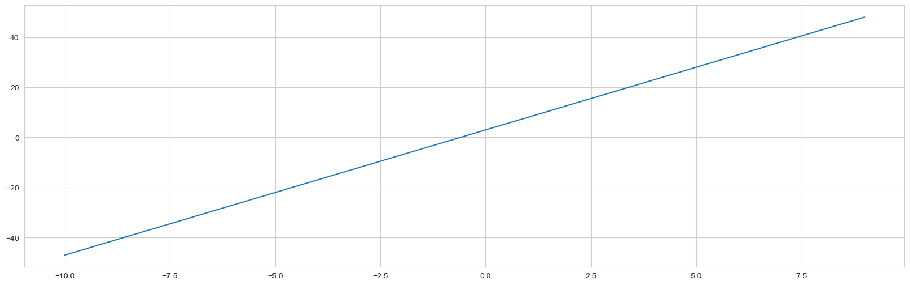

```python
# Practice 2-11
x1 = np.linspace(-10,10,100)
y1 = np.sin(x1)
y2 = np.cos(x1)
plt.figure(figsize=(20,6))
plt.plot(x1, y1, label='sin(x)')
plt.plot(x1, y2, label='cos(x)')
plt.legend()
plt.grid(True)
```
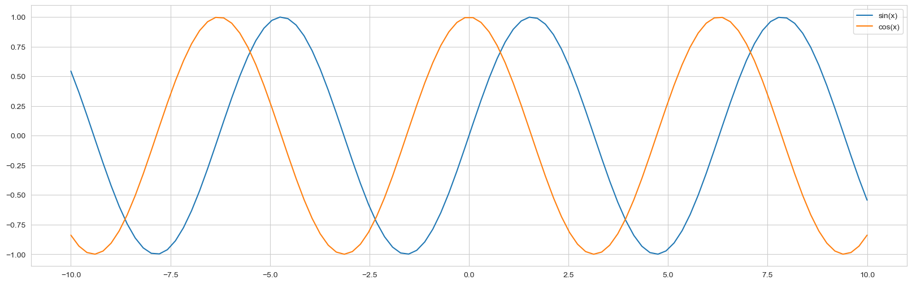

```python
# Practice 2-12
x3 = np.random.uniform(0, 1, 1000)
y3 = np.random.uniform(0, 1, 1000)

x4 = np.random.uniform(0, 1, 100000)
y4 = np.random.uniform(0, 1, 100000)

plt.figure(figsize=(10, 4))

plt.subplot(1, 2, 1)
plt.hist(x3, bins=20)

plt.subplot(1, 2, 2)
plt.hist(y3, bins=20)
```

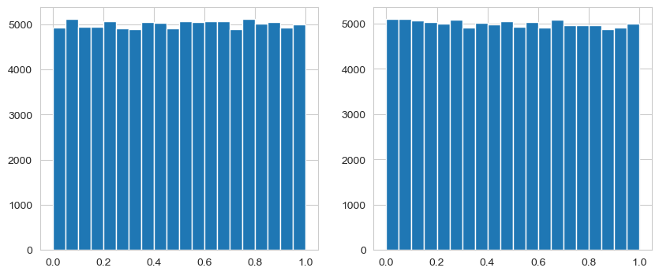

```python
# 2장 종합문제
# 1)
x5 = np.random.uniform(0, 1, 10000)
y5 = np.random.uniform(0, 1, 10000)

# 2)
dist = np.hypot(x5, y5)
inside = dist < 1
outside = dist >= 1
print(f"Inside Circle : {inside.sum()}")
print(f"Outside Circle : {outside.sum()}")

plt.figure(figsize=(10,10))
plt.scatter(x5[inside], y5[inside], color='blue', s=1)
plt.scatter(x5[outside], y5[outside], color='red', s=1)
circle = plt.Circle((0, 0), 1, color='green', fill=False)
plt.gca().add_artist(circle)
plt.xlabel('x')
plt.ylabel('y')
plt.xlim(0, 1)
plt.ylim(0, 1)
```
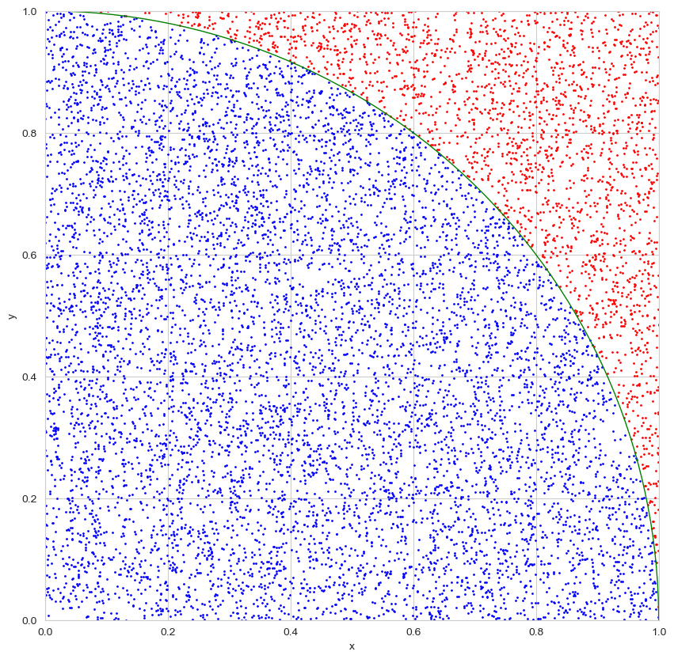
