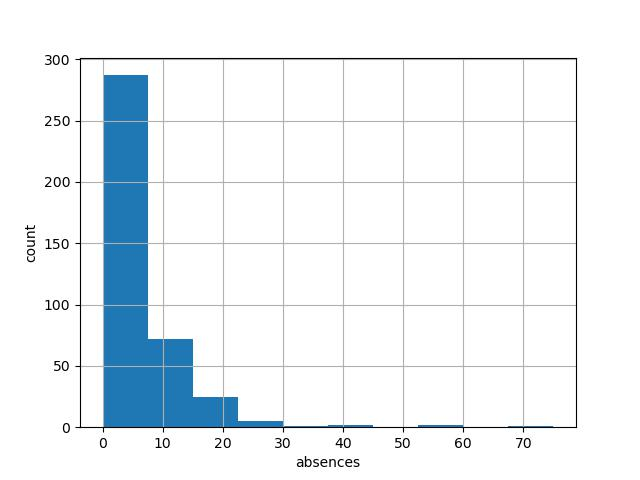

# Week03

### 기술통계와 단순회귀 분석
---

-   ####    통계의 종류
    -   #####   기술통계
        -   ######  수집한 데이터의 전체적인 특징을 파악하거나 이해하기 쉽도록 정리하는 방법
    -   #####   추론통계
        -   ######  확률을 추측하거나, 과거의 데이터를 사용해 미래를 예측할 때 활용.

-   #### 데이터 입력과 기본 분석
    ```python
    #라이브러리 임포트
    import pandas as pd
    import requests, zipfile
    from io import StringIO
    import io
    #라이브러리 임포트
    
    #데이터 가져오기
    url = 'http://archive.ics.uci.edu/ml/machine-learning-databases/00356/student.zip'

    r= requests.get(url,stream=True)
    z = zipfile.ZipFile(io.BytesIO(r.content))
    z.extractall()

    #data 읽기
    student_data_math = pd.read_csv('./python/csv/student-mat.csv')
    print(student_data_math.head()) #5행 읽기 

    #결과값
    #0  GP;"F";18;"U";"GT3";"A";4;4;"at_home";"teacher...
    #1  GP;"F";17;"U";"GT3";"T";1;1;"at_home";"other";...
    #2  GP;"F";15;"U";"LE3";"T";1;1;"at_home";"other";...
    #3  GP;"F";15;"U";"GT3";"T";4;2;"health";"services...
    #4  GP;"F";16;"U";"GT3";"T";3;3;"other";"other";"h...

    #data 구분하여 읽기
    student_data_math = pd.read_csv('./python/csv/student-mat.csv', sep=';')
    print(student_data_math.head()) #5행 읽기 

    #결과값
     school sex  age address famsize Pstatus  Medu  Fedu     Mjob      Fjob  reason guardian  traveltime  studytime  failures schoolsup famsup paid activities nursery higher internet romantic  famrel  freetime  goout  Dalc  Walc  health  absences  G1  G2  G3
    0     GP   F   18       U     GT3       A     4     4  at_home   teacher  course   mother           2          2         0       yes     no   no         no     yes    yes       no       no       4         3      4     1     1       3         6   5   6   6
    1     GP   F   17       U     GT3       T     1     1  at_home     other  course   father           1          2         0        no    yes   no         no      no    yes      yes       no       5         3      3     1     1       3         4   5   5   6
    2     GP   F   15       U     LE3       T     1     1  at_home     other   other   mother           1          2         3       yes     no  yes         no     yes    yes      yes       no       4         3      2     2     3       3        10   7   8  10
    3     GP   F   15       U     GT3       T     4     2   health  services    home   mother           1          3         0        no    yes  yes        yes     yes    yes      yes      yes       3         2      2     1     1       5         2  15  14  15
    4     GP   F   16       U     GT3       T     3     3    other     other    home   father           1          2         0        no    yes  yes         no     yes    yes       no       no       4         3      2     1     2       5         4   6  10  10
    ```
-   ##### 데이터 특성파악
    -   ###### 데이터 개수와 형을 확인
        ```python
        #모든 컬럼 정보 등 확인
        student_data_math.info()

        #결과값
         #   Column      Non-Null Count  Dtype 
        ---  ------      --------------  ----- 
        0   school      395 non-null    object
        1   sex         395 non-null    object
        2   age         395 non-null    int64 
        3   address     395 non-null    object
        4   famsize     395 non-null    object
        5   Pstatus     395 non-null    object
        6   Medu        395 non-null    int64 
        7   Fedu        395 non-null    int64
        8   Mjob        395 non-null    object
        9   Fjob        395 non-null    object
        10  reason      395 non-null    object
        11  guardian    395 non-null    object
        12  traveltime  395 non-null    int64
        13  studytime   395 non-null    int64
        14  failures    395 non-null    int64
        15  schoolsup   395 non-null    object
        16  famsup      395 non-null    object
        17  paid        395 non-null    object
        18  activities  395 non-null    object
        19  nursery     395 non-null    object
        20  higher      395 non-null    object
        21  internet    395 non-null    object
        22  romantic    395 non-null    object
        23  famrel      395 non-null    int64
        24  freetime    395 non-null    int64
        25  goout       395 non-null    int64
        26  Dalc        395 non-null    int64
        27  Walc        395 non-null    int64
        28  health      395 non-null    int64
        29  absences    395 non-null    int64
        30  G1          395 non-null    int64
        31  G2          395 non-null    int64
        32  G3          395 non-null    int64
        ```
        -   #####   타입 범위
        |타입|최소값|최대값|
        |-|-|-|
        |int64|-9,223,372,036,854,775,808|+9,223,372,036,854,775,807

-   #####   정량 데이터와 정성 데이터
    -   ######  정량데이터
        -  숫자로 표현가능한 데이터 ex) 사람 수 또는 금액
        ```python
        #결석일
        student_data_math['absences'].head()
        #결과값
        0     6
        1     4
        2    10
        3     2
        4     4
        ```
    -   ######  정성데이터
        -   계산이 불가한 데이터 ex) 성별, 직업 등
        ```python
        #성별별
        student_data_math['sex'].head()
        #결과값
        0    F
        1    F
        2    F
        3    F
        4    F
        ```
-   #####   기술통계
    -   ######  히스토그램
    ```python
    #histogram, 변수 데이터 지정
    plt.hist(student_data_math['absences'])

    #x축과 y축의 레이블
    plt.xlabel('absences')
    plt.ylabel('count')

    #그리드 추가
    plt.gird(True)
    ```
    

-   #####   평균, 중앙값, 최빈값
    ```python
    #평균값
    print('평균값',student_data_math['absences'].mean())
    #중앙값
    print('중앙값',student_data_math['absences'].median())
    #최빈값: 가장 빈도가 많은값
    print('최빈값값',student_data_math['absences'].mode())

    #결과
    평균값 5.708860759493671
    중앙값 4.0
    최빈값값 0    0
    Name: absences, dtype: int64
    ```
    - ###### 평균
        $\bar{x} = \frac{1}{n} \sum_{i=1}^{n}x_i $

    - ###### 분산과 표준편차
        -   ######  분산(평균값 주변에 몰려있는지)
            $\alpha^2 = \frac{1}{n} \sum_{i=1}^{n} (x_i - \mu)^2$
            <br/>
            >값이 작을 수록 흩어진 정도가 작다는 의미

            ```python
            #분산
            student_data_math['absences'].var(ddof=0)
            #63.887389841371515
            ```
        - ######    표준편차
            $\sigma = \sqrt{ \frac{1}{n} \sum_{i=1}^{n} (x_i - \mu)^2 }$
            <br/>
            >   평균으로부터 얼마나 퍼져있는지 수치로 알려주는지표 
            >   값이 동일할 경우 0

            ```python
            #표준편차
            student_data_math['absences'].std(ddof=0)
            
            #분산의 제곱근으로도 구할수 있음
            np.sqrt(student_data_math['absences'].var(ddof=0)) 

            #결과
            7.992958766400057
            ```
    -   ######  요약 통계량과 백분위수
        - DataFrame을 decribe 메서드를 통해 모든 통계량을 알 수 있다.
            ```python
            # 모든열 통계량
            student_data_math.describe()

            # 요약 통계량
            student_data_math['absences'].describe()

            #결과
            count    395.000000
            mean       5.708861
            std        8.003096
            min        0.000000
            25%        0.000000
            50%        4.000000
            75%        8.000000
            max       75.000000
            Name: absences, dtype: float64
            ```
            >   총 데이터 100개라고 가정할 시
            >   50% 백분위수라면 50번째 값(중앙값)
            >   25% 는 1사분위 (25번째 값)
            >   75% 는 3사분위 (75번째 값)
            >   std (표준편차)
            ```python
            #사분위범위(75% - 25%)
            student_data_math['absences'].describe()[6] 
                - student_data_math['absences'].describe()[4]
            
            #결과
            8.0
            ```
    -   ######  박스플롯 그래프
        -   박스플롯은 박스의 윗부분이 3분위수 , 아래부분이 1분위수 중앙선이 중앙값 윗선이 최댓값 아래선이 최솟값이다.
        ```python
        #글자 깨짐방지
        from matplotlib import font_manager, rc
        font_path="./python/pont/malgun.ttf"
        font_name = font_manager.FontProperties(fname=font_path).get_name()
        rc('font', family=font_name)

        #박스플롯: G1
        plt.subplot(1,2,1)
        plt.boxplot(student_data_math['G1'])
        plt.title('1학기 성적')
        plt.subplot(1,2,2)

        #박스플롯: absences
        plt.boxplot(student_data_math['absences'])
        plt.title('결석일')
        plt.grid(True)
        plt.show()
        ```
        
        
        >   결석일 수 박스플롯의 범위에 포함되지 않은 데이터는 데이터 이상값이다.
        >   최댓값은 일반적으로 (3분위수 - 1분위수) X 1.5 + 3분위수 이내에서 최댓값을 말하고 
        >   이 범위를 벗어나면 이상값으로 나타낸다.
    
    -   ##### 변동계수
        -   두 데이터의 편차의 차이에 상관없이 비교할 수 있는 수치
            #### $CV = \frac{\alpha}{\bar{x}}$
            ``` python
            # 분산/평균
            student_data_math['absences'].std()/student_data_math['absences'].mean()

            #결과값
            1.4018726369879067
            ```
            >   값이 클수록 분산이 크다.
    
    
    <br/>

    -   ##### 산점도와 상관계수
        -   1학기 성적과 3학기 성적 산점도
        <br/>
        <div style="display: flex; gap: 20px;">

        <!-- 왼쪽: 코드 박스 -->
        <div style="flex: 1; display: flex; justify-content: center;">
        <pre style="background-color:rgb(255, 252, 252); border-radius:">
            <code>
            # 산점도
            plt.plot(student_data_math['G1'], student_data_math['G3'], 'o')
            plt.xlabel('G1 grade')
            plt.ylabel('G3 grade')
            plt.grid(True)
            plt.show()
            </code>
        </pre>
        </div>

        <!-- 오른쪽: 이미지 -->
        <div style="flex: 1; display: flex; justify-content: center; align-items: center;">
        
        </div>
        </div>
        
-   #####   공분산
    -   두 변수 사이의 관계 방향을 알 수 있다. 두 변수간 편차를 곱하고 그걸 평균 내어 계산 
        $S_{xy} = \frac{1}{n}\sum_{i=1}^{n}(x_i - \bar{x})(y_i - \bar{y})$
        ```python
        np.cov(student_data_math['G1'], student_data_math['G3'])
        #결과
        [[11.01705327 12.18768232]
        [12.18768232 20.9896164 ]]
        ```
        >   G1 과 G3의 공분산 : 행렬 (1,2) (2,1)
        >   G1의 분산 : 행렬 (1,1)
        >   G3의 분산 : 행렬 (2,2)
        >   |공분산 값|의미|
        >   |-|-|
        >   |$Cov(x,y) > 0$|x 증가 -> y도 증가(양의 상관관계)
        >   |$Cov(x,y) < 0$|x 증가 -> y도 감소(음의 상관관계)
        >   |$Cov(x,y) = 0$|관계없음(선형 관계가 아님)
<br/>

-   #####   상관계수
    -   상관계수는 공분산을 각 변수의 표준편차로 나눈 값
        ### $r_{xy} = \frac{ \sum_{i=1}^{n} (x_i - \bar{x})(y_i - \bar{y}) }{ \sqrt{ \sum_{i=1}^{n} (x_i - \bar{x})^2 } \sqrt{ \sum_{i=1}^{n} (y_i - \bar{y})^2 } }$

        ```python
        from scipy import stats

        stats.pearsonr(student_data_math['G1'], student_data_math['G3'])
        #결과
        (statistic=0.8014679320174142, pvalue=9.00143031227676e-90)
        #상관행렬
        np.corrcoef([student_data_math['G1'], student_data_math['G3']])

        ```
        >   상관계수는 -1 부터 1 사이의 값이며, 1에 가까울수록 양의 상관관계 
        >   -1 에 가까우면 음의 상관관계 , 0일 시 상관관계가 없다.

-   #####   연습문제
    


